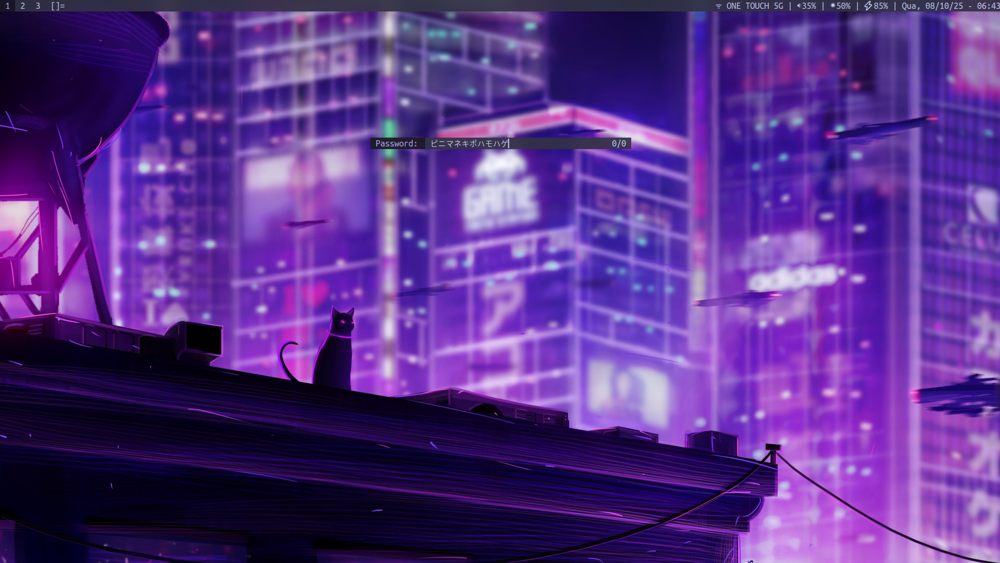

# **dmenu-mask**
Add the option `-M [mask]` to dmenu, where all user input will be masked using the characters passed as `[mask]`.

## **What is the value [mask]**
Any sequence of utf-8 characters, the characters are choosen randonly and replaces the character typed, which can also be any utf-8 character.

## **How does it Work**
`dmenu-mask` adds a new buffer `masktext` which is synchronized with the `text` buffer at a utf-8 rune level.

### **Why a new buffer**
#### **Solution 1* - Dynamic Mask*
We can use `createmaskinput()` at the function `draw()`, in which will mask the input _'dynamically'_. Each call to `draw()` will generate a new random mask, which is a solution, but not the one I wanted.

#### **Solution 2 - Static Mask**
To have a _'persistent'_ mask, one which will update only when new text inserted or deleted, we need a new buffer to store that mask, and also, a new variable to traverse the text (`maskcursor`), new functions to navigate at a rune level (`nextrune_mask()`, `nth_rune()`), and functions to insert/update a mask (`insert_mask()`, `createmaskinput()` and `utf8_strlen()`).

## **Shortcuts With `-M` Active**
* **`Ctrl+k` (Delete Right)**     -> Deletes all text to the right of the cursor.
* **`Ctrl+u` (Delete Left)**      -> Deletes all text to the left of the cursor.
* **`Ctrl+w` (Delete Word)**      -> The whole text is treated as a word, deletes all text.
* **`Ctrl+Left` (Previous Word)** -> The whole text is treated as a word, goes to the start.
* **`Ctrl+Right` (Next Word)**    -> The whole text is treated as a word, goes to the end.
* **`Alt+b` (Previous Word)**     -> Same as `Ctrl+Left`.
* **`Alt+f` (Next Word)**         -> Same as `Ctrl+Right`.

## **Know Problems**
`-M` is not supposed to be used with options, as does not make sense to match masked text with options, so i did not changed the behaviour of any matching shortcut/function. Maybe in the future this changes might be added, but for now it is already a big patch, there are almost no reason to make it even bigger for non-intended use safeguards.

## **Example**
My own [setup](https://github.com/flavio-munis/rice). I Have set a environment variable:

`PASSWORD_MASK="アイウエオカキクケコサシスセソタチツテトナニヌネノハヒフヘホマミムメモヤユヨラリルレロワヰヱヲガギグゲゴザジズゼゾダヂヅデドバビブベボパピプペポ"` 

The use is as follows with dmenu: 
`dmenu -M $PASSWORD_MASK -p "Password: " <&-`

Use `dmenu -M "*" <&-` for the classic password mask.

## **Inspirations**
* [dmenu2](https://github.com/muff1nman/dmenu2)
* [dmenu-password](https://tools.suckless.org/dmenu/patches/password/)

## Todo
[ ] - Allow mask to be nothing and no text be show, similar to inputing password on tty mode.
